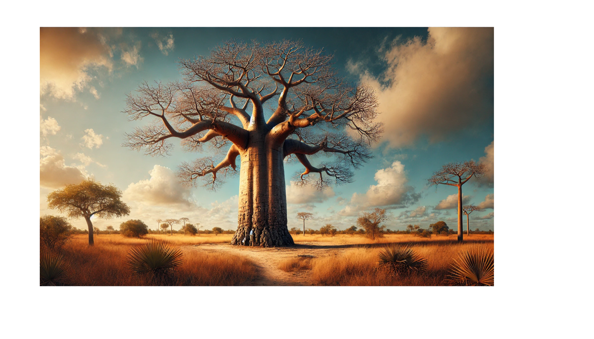

     

GStreamer pipelines for constructing media applications using Node.

#### Development Requirements

-   Node 20+
-   pnpm 7.29.1+
-   just (cargo install just)
-   @napi-rs/cli (pnpm add -g @napi-rs/cli)
-   Rust 1.73+
-   Docker
-   Nvidia GPU (optional)
-   GStreamer 1.23 and related dependencies [see](https://github.com/SteveMcFarlin/gst-docker)

#### Development

TODO

#### Building

TODO

#### Running

TODO

#### Useful Tools

-   [GStreamer Docs](https://gstreamer.freedesktop.org/documentation/)
-   [Graphviz](https://graphviz.org/) - For viewing dot files
-   [GstShark](https://developer.ridgerun.com/wiki/index.php/GstShark) - Proformance analysis tool
-   [Tracy](https://github.com/wolfpld/tracy) - Profiler if tracing tracy is enabled. see [tracing-gstreamer](https://github.com/standard-ai/tracing-gstreamer)
-   [DgiStreamer](https://dgistreamer.com/)
-   [GstPipelineStuido](https://github.com/dabrain34/GstPipelineStudio)
